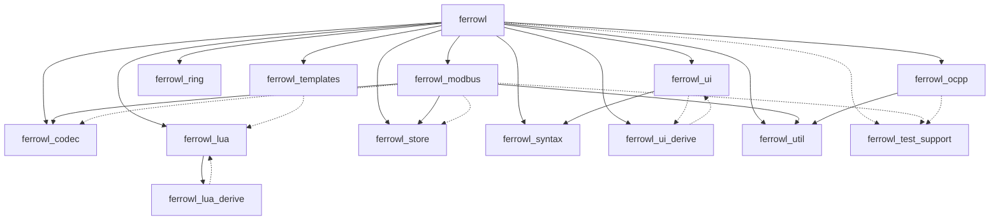

# Architecture

How ferrowl is put together: the workspace graph, what each crate owns, and how
the pieces interact at runtime. For *what the software must do* (behavior,
per-capability), see [`docs/specs/`](./docs/specs/); this file is the structural
map, not the spec.

## Workspace

Ferrowl is a Cargo workspace (resolver `"3"`, edition 2024) building one binary,
`ferrowl`, from fourteen crates. All fourteen are versioned in lockstep; none is
published independently.

| Crate | Responsibility |
|---|---|
| `ferrowl` | The binary. Event/redraw loop, tabs, views, dialogs, the `:` command line, session & device configuration, the `migrate` and `run` subcommands, the headless runner. |
| `ferrowl-ui` | Reusable [ratatui](https://ratatui.rs) building blocks: widgets and their state types, styling, alternate-screen handling, dialogs, tables. |
| `ferrowl-ui-derive` | Proc macros for the UI layer: `#[derive(TableEntry)]`, `#[derive(Overlay)]`, `#[derive(Focus)]` (keyboard focus cycling and event dispatch for views). |
| `ferrowl-lua-derive` | Proc macro `#[derive(Module)]`, which bridges a Rust host type into a Lua `C_*` module. |
| `ferrowl-codec` | Register descriptions (slave id, function code, address, access, format) and the codec between raw `u16` words and typed values. |
| `ferrowl-store` | In-memory model of a Modbus register space — access-checked value cells, shared as `Arc<RwLock<Memory>>`. |
| `ferrowl-modbus` | Modbus client and server tasks over TCP and RTU, on [rust-modbus](https://github.com/TumbleOwlee/rust-modbus). |
| `ferrowl-ocpp` | OCPP transport and engine core: JSON-on-WebSocket framing, connection and correlation, and the version-generic Charging Station / CSMS engine cores (a `Version` trait over 1.6 / 2.0.1 / 2.1), wrapping [rust-ocpp](https://github.com/codelabsab/rust-ocpp). The per-version actions, spec tables, and device state machines live in the `ferrowl` binary. |
| `ferrowl-lua` | Embedded Lua 5.4 runtime ([mlua](https://github.com/mlua-rs/mlua)) and the `C_*` module framework — the restricted sandbox and the trait shells scripts call. It has no dependency on the Modbus or OCPP crates; the concrete `C_Register` / `C_OCPP` wiring to `ferrowl-store::Memory` and the OCPP state lives in the `ferrowl` binary. |
| `ferrowl-templates` | The bundled Lua script-template library. A build script walks `templates/<context>/…` and generates the `TEMPLATES` array at compile time; carries its own `TemplateContext`, which the binary maps to its `ScriptContext`. |
| `ferrowl-syntax` | Syntax highlighting for the in-TUI code editor (Lua, JSON, Markdown and Diff). |
| `ferrowl-ring` | Fixed-capacity ring buffer generic over the element type; backs each module's log pane. |
| `ferrowl-util` | Shared helpers with two or more consumers: the exponential-backoff retry driver (`backoff`) consumed by `ferrowl-modbus`'s client and all six server transports and by `ferrowl-ocpp`'s CS and CSMS reconnect loops, `~` path expansion (`path`), and the shared TLS policy enums (`tls`). A helper with a single consumer lives in that consumer instead. |
| `ferrowl-test-support` | Dev-only test fixtures: held-port guards (`reserve_tcp_port`/`reserve_udp_port`) and per-run temp directories (`reserve_temp_dir`). `publish = false`, a dev-dependency of the crates that test against sockets or the filesystem; no production code depends on it. |

New code goes in the crate whose Responsibility row covers it; if no row covers
it, the same branch changes a row.

Grouped by concern: **Modbus** (`ferrowl-codec`, `ferrowl-store`, `ferrowl-modbus`),
**OCPP** (`ferrowl-ocpp`), **Lua** (`ferrowl-lua`, `ferrowl-lua-derive`, `ferrowl-templates`),
**UI** (`ferrowl-ui`, `ferrowl-ui-derive`, `ferrowl-syntax`),
**Infra** (`ferrowl-ring`, `ferrowl-util`, `ferrowl-test-support` (dev-only)), and the **binary** (`ferrowl`) that ties
them together.

## Dependency rules

The allowed internal edges, both normal (production) and dev-dependency:

| From | Kind | To |
|---|---|---|
| `ferrowl` | normal | `ferrowl-codec`, `ferrowl-lua`, `ferrowl-modbus`, `ferrowl-ocpp`, `ferrowl-ring`, `ferrowl-store`, `ferrowl-syntax`, `ferrowl-templates`, `ferrowl-ui`, `ferrowl-ui-derive`, `ferrowl-util` |
| `ferrowl` | dev | `ferrowl-test-support` |
| `ferrowl-modbus` | normal | `ferrowl-codec`, `ferrowl-store`, `ferrowl-util` |
| `ferrowl-modbus` | dev | `ferrowl-test-support`, `ferrowl-codec`, `ferrowl-store` |
| `ferrowl-ocpp` | normal | `ferrowl-util` |
| `ferrowl-ocpp` | dev | `ferrowl-test-support` |
| `ferrowl-lua` | normal | `ferrowl-lua-derive` |
| `ferrowl-ui` | normal | `ferrowl-syntax` |
| `ferrowl-ui` | dev | `ferrowl-ui-derive` |
| `ferrowl-lua-derive` | dev | `ferrowl-lua` |
| `ferrowl-ui-derive` | dev | `ferrowl-ui` |
| `ferrowl-templates` | dev | `ferrowl-lua` |
| `ferrowl-codec` | normal | none |
| `ferrowl-store` | normal | none |
| `ferrowl-ring` | normal | none |
| `ferrowl-util` | normal | none |
| `ferrowl-syntax` | normal | none |
| `ferrowl-templates` | normal | none |
| `ferrowl-ui-derive` | normal | none |
| `ferrowl-lua-derive` | normal | none |
| `ferrowl-test-support` | normal | none |

The three dev edges `ferrowl-lua-derive → ferrowl-lua`, `ferrowl-ui-derive →
ferrowl-ui`, and `ferrowl-templates → ferrowl-lua` run opposite their crate's
normal dependency (or have no normal counterpart at all): a proc-macro or
template crate testing itself through the crate that consumes it. This is by
design, not a cycle.

Crates absent from a `From` row have no internal dependency of that kind;
absence from the table never means "unconstrained".

- No crate depends on `ferrowl`.
- `ferrowl-ring` and `ferrowl-util` never depend on another workspace crate.
- The Modbus group (`ferrowl-codec`, `ferrowl-store`, `ferrowl-modbus`) and the
  OCPP group (`ferrowl-ocpp`) never depend on each other; anything spanning
  both lives in the binary.
- UI crates (`ferrowl-ui`, `ferrowl-ui-derive`, `ferrowl-syntax`) never depend
  on a protocol crate.
- `ferrowl-lua` never depends on a protocol crate; the concrete `C_Register` /
  `C_OCPP` wiring lives in the binary.
- No production dependency on `ferrowl-test-support`; it is a dev-dependency
  only.
- A new internal edge is legal only if the same branch adds it to this table.
  An edge in `Cargo.toml` that the table does not list is a defect in one of
  the two.

## Runtime data flow

The unit of work is a **module instance** — one configured Modbus or OCPP device,
shown as one tab. Each instance owns a shared, lock-protected state store:
`ferrowl-store::Memory` for Modbus, an `Arc<RwLock<S>>` state struct for OCPP.
Three concurrent parties touch that store:

1. **The network task** — a Modbus client polling a remote server (or a server
   answering incoming requests), or an OCPP connection (CS dialling a CSMS, or a
   CSMS accepting stations). It reads and writes the store.
2. **The Lua sim thread** — if scripts are configured, it reads and writes the same
   store through the typed `C_Register` / `C_OCPP` bridge, on a timer.
3. **The UI** — polls the store every redraw tick and renders it as a table.

## Concurrency model

The hot read/write path uses `parking_lot` synchronous locks, not `tokio::sync` —
deliberately, to avoid async-lock overhead and blocking-runtime pitfalls on a path
the UI hits every tick. Each Lua sim runs on its own dedicated OS thread, isolated
from the tokio runtime and the UI redraw loop, so a slow script cannot stall polling
or rendering. Modbus and OCPP are architecturally separate: there is no shared
`Instance<T>`-style lifecycle abstraction spanning both, and a pattern in one does
not necessarily transfer to the other.

The precise concurrency guarantees per module type are specified in
[`docs/specs/modbus/`](./docs/specs/modbus/) and
[`docs/specs/scripting/`](./docs/specs/scripting/).

## Where the internal-crate contracts live

The derive macros and highlighting crates have no capability spec of their own;
their observable contracts are specified where they are used:

- `#[derive(Module)]` (from `ferrowl-lua-derive`) → the `C_*` API it produces is
  specified in [`docs/specs/scripting/api-contract.md`](./docs/specs/scripting/api-contract.md).
- `#[derive(Focus/TableEntry/Overlay)]` (from `ferrowl-ui-derive`) and syntax
  highlighting (`ferrowl-syntax`) → their observable behavior is specified in
  [`docs/specs/tui/`](./docs/specs/tui/).
- `ferrowl-ring` and `ferrowl-util` are plain infrastructure; their contracts are
  their rustdoc.

A library crate's error type never carries another workspace crate's error as
a `String`; it keeps the typed cause. One crate's error enters another's
through a `From` impl that maps variant to variant — `impl
From<ferrowl_util::tls::PolicyError> for TlsError`, in both `ferrowl-modbus`
and `ferrowl-ocpp`. A `String` payload carries data the error is about (a
path, a field name, a user-supplied value), never another workspace crate's
cause. The `ferrowl` binary is exempt as the terminal consumer: rendering an
error as a CLI message, a Lua error string or a wire payload at the point of
final use is what that code is for. Wrapping a third-party error is outside
this rule at every layer.

## Map to the specs

| Area | Crates | Spec |
|---|---|---|
| Modbus | `ferrowl-codec`, `ferrowl-store`, `ferrowl-modbus` | [`docs/specs/modbus/`](./docs/specs/modbus/) |
| OCPP | `ferrowl-ocpp` (transport + engine core), most of the OCPP behavior in `ferrowl` | [`docs/specs/ocpp/`](./docs/specs/ocpp/) |
| Scripting | `ferrowl-lua`, `ferrowl-lua-derive`, `ferrowl-templates`, the `C_*` wiring in `ferrowl` | [`docs/specs/scripting/`](./docs/specs/scripting/) |
| TUI | `ferrowl-ui`, `ferrowl-ui-derive`, `ferrowl-syntax` | [`docs/specs/tui/`](./docs/specs/tui/) |
| Config & session | parts of `ferrowl` | [`docs/specs/config-session/`](./docs/specs/config-session/) |
| CLI & headless | parts of `ferrowl` | [`docs/specs/cli-headless/`](./docs/specs/cli-headless/) |

