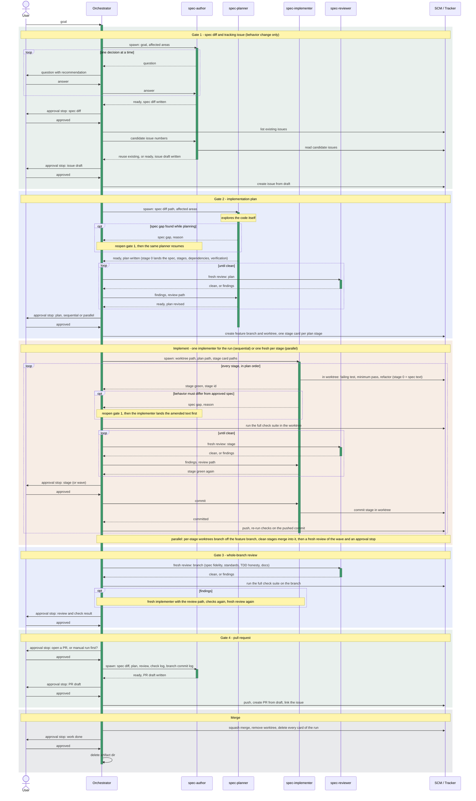

# Contributing to Ferrowl

Thanks for your interest in contributing! This document covers the essentials to get you productive quickly.

## Setup

Ferrowl is written in Rust (stable toolchain, pinned via `rust-toolchain.toml`). Install the toolchain via [rustup.rs](https://rustup.rs/), then:

```sh
git clone <your-fork>
cd ferrowl
cargo build --release
```

Run the app during development with `cargo run --release -- --demo` (starts a demo server) or see `--help` for all runtime options.

Optionally install [lefthook](https://github.com/evilmartians/lefthook) and run
`lefthook install` to get the pre-commit checks locally. The coverage gate also
needs `cargo-llvm-cov`:

```sh
cargo install cargo-llvm-cov --locked
```

## Project Layout

The repository is a Cargo workspace building the `ferrowl` binary. See
[`ARCHITECTURE.md`](./ARCHITECTURE.md) for the crate dependency graph and each
crate's responsibility, and [`PRD.md`](./PRD.md) for the product framing.

Ferrowl is **spec-driven**: [`docs/specs/`](./docs/specs/) is the authoritative
specification of what the software must do, split by capability area. The code is
expected to conform to it. Before changing behavior, read the relevant area's
`requirements.md` and `edge-cases.md`.

## Test-Driven Development

Write the test first, watch it fail, then implement. A test written after the
code it covers asserts what you built rather than what the specification
requires — derive expected values from the authoritative source (protocol spec,
upstream API), never from a debug print of your own implementation.

Every new or changed requirement ships with at least one test whose doc comment
cites the requirement ID, directly beside the test declaration:

```rust
#[test]
/// MB-R-012 — The checksum is computed over the full frame excluding the checksum field.
fn ut_checksum_excludes_trailer() { /* … */ }
```

Line coverage must stay at or above **80%**, enforced in CI. Coverage is a
floor, not a goal — never pad it with tests that execute code without
asserting on it.

## Before Submitting

Please make sure the following pass locally:

```sh
cargo fmt --check
cargo clippy --workspace -- -D warnings
cargo check --workspace
cargo test --workspace
cargo llvm-cov --workspace --fail-under-lines 80
```

CI runs these as separate steps of the `check` pipeline — on every push **and every pull request** — so anything the pre-commit hook would reject is rejected by CI too. A `nightly` workflow (only run on `main`) builds the prebuilt executables published on the Release page.

## Pull Requests

- Branch off `main` and open your PR against `main`. Branch naming: `<type>/<slug>` with a conventional-commit type (`feat/`, `fix/`, `docs/`).
- Keep PRs focused — one feature or fix per PR.
- Add or update tests for behavior changes; the existing unit tests live in `#[cfg(test)]` modules next to the code (`ut_*` naming); integration tests live in each crate's `tests/` (`it_*` naming).
- **Update the spec in the same PR.** When you change behavior, update the relevant `docs/specs/<area>/` file(s) — they are the authoritative source, not a one-time snapshot. New requirements get a fresh, appended ID (never renumber or reuse). A behavior change with no spec change is incomplete.
- Reference requirement IDs in the PR body.
- Update the README when you change user-facing commands, keybindings, configuration fields, or the Lua API.
- PRs are merged to `main` by **squash merge**.
- No tool attribution trailers — no `Co-Authored-By` for an assistant, no "Generated with" line — in commit messages, PR bodies, issues or comments.

## Agent Workflow

Agents working in this repo follow the gated workflow in
[`AGENTS.md`](./AGENTS.md) and [`.claude/AGENTS.workflow.md`](./.claude/AGENTS.workflow.md);
human contributors are welcome to, but the checks above are the hard requirements.
The diagram below is the map; the workflow file is the authority when they disagree.

How to read it: each lane is one participant. The user only ever talks to the
orchestrator. The orchestrator spawns agents, relays one question at a time, moves
task-board cards and runs SCM and tracker plumbing; it never reads or writes spec,
code, plan or review content. Every agent writes its output to a file under
`artifacts/<slug>/` (or into its worktree) and ends its turn with a one-line status;
only file paths and status lines cross the lane into the orchestrator. An activation
bar on a lane marks the span in which that agent exists; a bar that ends is an agent
that is gone, and the next bar on the same lane is a fresh spawn with no memory of
the previous one.

Three interactions recur at every gate and are drawn as one arrow each:

- **approval stop** — the orchestrator opens the file in a viewer outside the conversation and halts. A requested change goes back to the same, still-alive agent; only an explicit approval lets the run continue.
- **fresh review** — a new `spec-reviewer` with no shared context reads one scope (plan, stage, wave or branch), writes its review and is gone. Findings go back to the agent that wrote the work, never to the orchestrator, and another fresh review follows.
- **reopen gate 1** — approved spec text turned out not to cover something the planner or implementer found. A `spec-author` amends the spec diff and drafts a comment for the tracking issue, the user approves, the orchestrator posts the comment, and the paused agent resumes with the amended text. The issue body itself is never edited.

The entry point depends on the kind of change: a behavior change of any size starts
at gate 1; a non-behavior change (refactor, rename, test-only, docs, tooling) skips
gate 1 and starts at gate 2; a trivial edit (one file, no semantics) needs no gates,
just a branch and a PR.



`.claude/tasks/` is the workflow's execution state: the directory a card sits in is
its state (`open`, `inprogress`, `inreview`, `done`), so an interrupted session
resumes instead of restarting. The directories are tracked, the cards inside are
local and gitignored. Nothing there needs maintaining by hand.

## Reporting Issues

Open a GitHub issue with steps to reproduce, the ferrowl version (or commit), and your platform. For TUI rendering issues, the terminal emulator and size are helpful too.
