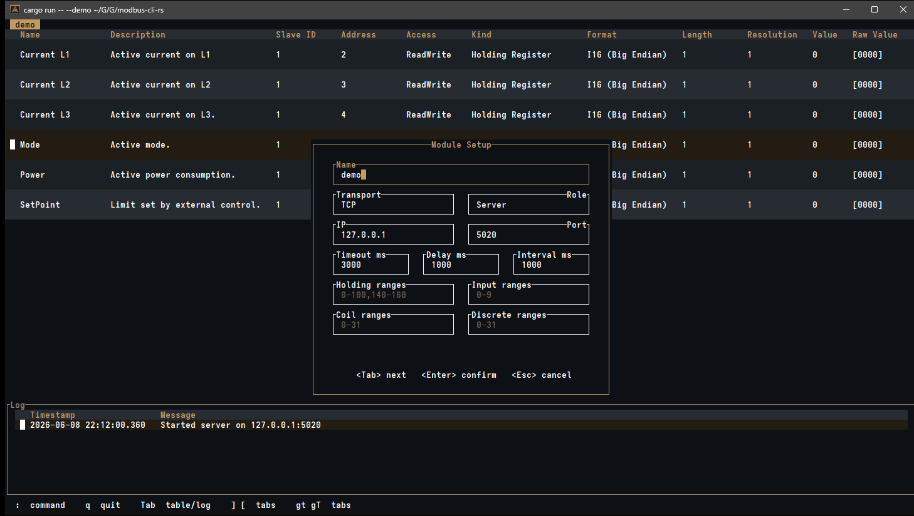
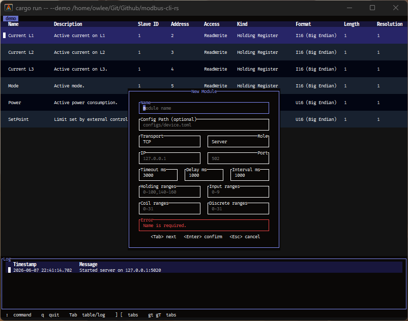
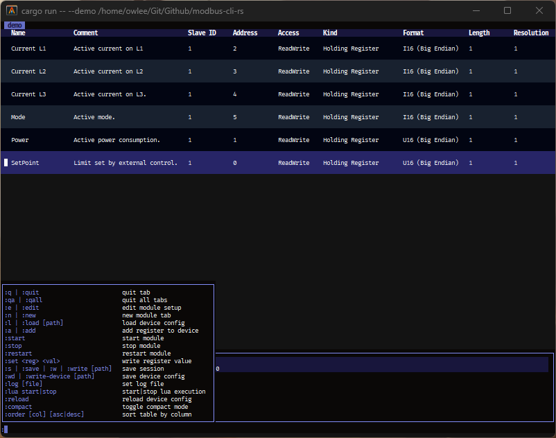
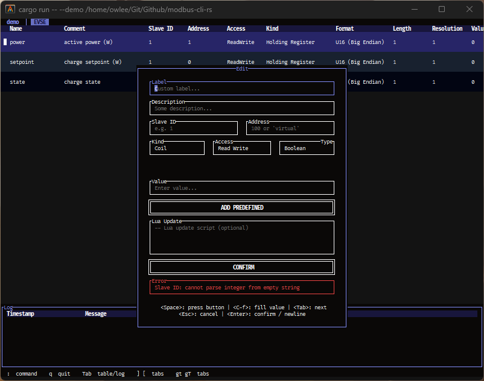
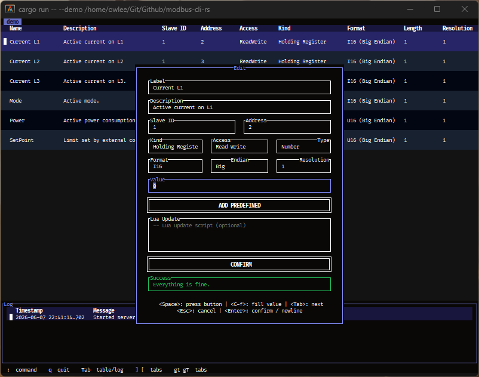
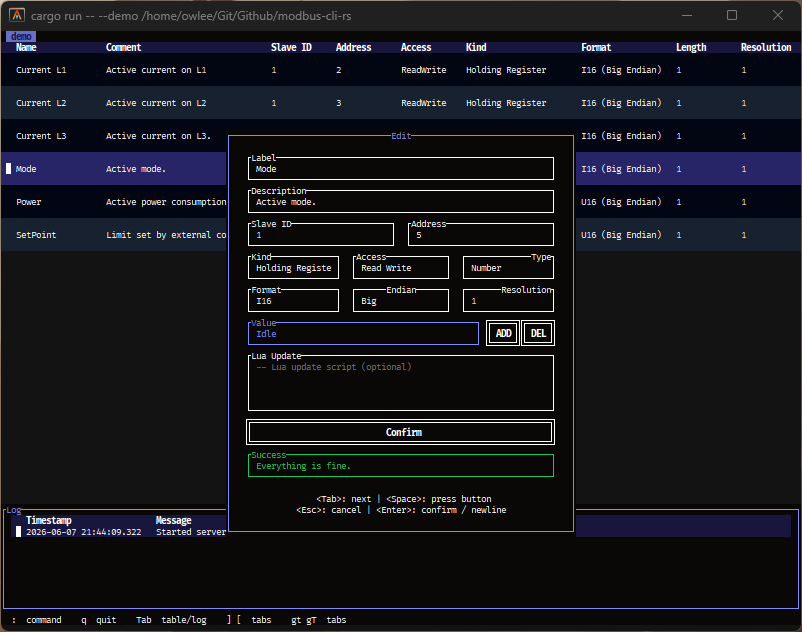

# Ferrowl - TUI Modbus Server + Client

[](#) [](https://github-ci.code-ape.dev/repos/3) [](https://github-ci.code-ape.dev/repos/3)

Ferrowl is a TUI application, written in Rust, to provide Modbus Client and Server capabilities. Create configurations on the fly, save and load configurations or session to setup multiple Modbus Clients or Servers. The aim is to provide a technical but intuitive interface that can run on any device without an available GUI environment.

If you prefer a GUI application, this tool is not the right choice. In these cases refer to GUI application like [QModbus](https://github.com/ed-chemnitz/qmodbus/).

> [!WARNING]
> Prior to **v0.4.0** the application was based on a draft implementation. Over time additional features were added but messed up the architecture and made it difficult to add new views, dialogs and support of multiple instances. Thus, starting with **v0.4.0** the application got a full rewrite. This also affects the configurations files and their management. Therefore, a compatibility layer is planned but is *currently* not available. It will be added as fast as possible.

## Goal

Provide a CLI application to simulate Modbus Servers and Clients, visualize the states of all registers, make register manipulation available and provide script based simulation capabilities - e.g. utilize the tool to simulate EVSEs based on the Modbus protocol.

## Nightly Build

This repository provides an updated Nightly build - available on the Release page. Prebuilt executables are provided for Unix and Windows.

## Quickstart

This project is written in Rust, thus you will have to install the Rust toolchain to compile it. Just follow the instructions on [rustup.rs](https://rustup.rs/) to set up the environment. Afterwards you are able to compile this project from source using the following command.

```sh
cargo build --release
```

Alternatively, you can also run it directly using the following command. Please refer to `--help` for all available runtime options and to the Release page for prebuilt binaries.

```bash
# Build and run
cargo run --release

# Or with the application already built
ferrowl

# Or in demo mode
ferrowl --demo

# Or with an existing session file
ferrowl --session session.toml
```

If started without any additional parameters, the module setup dialog is shown. After the module is created, you can add registers using the `:add` command.

> [!INFO]
> You can use *VIM*-like table navigation or alternatively the arrow keys. You can exit using the `:qa` command. Typing `:` will automatically switch to command mode. See the shown overlay for all available commands.

## Commands

| Keybind | Description |
| ----- | ----- |
| `:q \| :quit` | Quit tab / Close active module |
| `:qa \| :qall` | Close all tabs / Exit applciation |
| `:e \| :edit` | Edit current module | 
| `:n \| :new` | Create new module |
| `:l \| :load [PATH]` | Load device configuration |
| `:a \| :add` | Add new register to module |
| `:start` | Start module execution |
| `:stop` | Stop module execution |
| `:restart` | Restart module execution |
| `:set <reg> <val>` | Write register value |
| `:s \| :save \| :w \| :write [PATH]` | Save session |
| `:wd \| :write-device [PATH]` | Save device configuration |
| `:log [FILE]` | Set log output file |
| `:lua start\|stop` | Start/Stop lua execution |
| `:reload` | Reload device configuration |
| `:compact` | Toggle compact table mode |
| `:order [col] [asc\|desc]` | Sort table by column | 

## Keybindings

| Keybind | Description |
| ----- | ----- |
| `Enter` | Open/Confirm dialog |
| `Escape` | Cancel dialogs |
| `k \| Up` | Select previous table entry |
| `h \| Left` | Scroll left in table view |
| `l \| Right` | Scroll right in table view |
| `j \| Down` | Select next table entry |
| `Tab` | Focus next dialog element |
| `Shift-Tab` | Focus previous dialog element |
| `Space` | Click focused button |
| `G` | Move to bottom of table |
| `g` | Move to top of table |
| `0` | Move to left edge of table |
| `$` | Move to right edge of table |

## Impressions

### Module Setup

<p align="center">
    <p align="center">
        
    </p>
</p>

### New Dialog

<p align="center">
    <p align="center">
        
    </p>
</p>

### Command Help

<p align="center">
    <p align="center">
        
    </p>
</p>

### Add Dialog

<p align="center">
    <p align="center">
        
    </p>
</p>

### Edit Dialog

<p align="center">
    <p align="center">
        
    </p>
</p>

<p align="center">
    <p align="center">
        
    </p>
</p>

## Configuration

### Session Configuration

The seesion configuration can be saved using `:write` and contains the module configuration consisting of the name, path to the device configuration, the role and endpoint information.

```toml
[[modules]]
name = "evse-1"
device = "configs/evse.toml"
role = "server"

[modules.endpoint]
transport = "tcp"
ip = "127.0.0.1"
port = 5020
```

### Device Configuration

The device configuration can be saved using `:write-device` and contains the register information of the device and all necessary timings.

```toml
comment = "EVSE charge point"

[definitions.setpoint]
slave_id = 1
read_code = 4          # 4 = holding register
address = 0
type = "U16"
access = "ReadWrite"
comment = "charge setpoint (W)"

[definitions.power]
slave_id = 1
read_code = 4
address = 1
type = "U16"
access = "ReadWrite"
comment = "active power (W)"
# Lua run every cycle: mirror the setpoint into the power register (server simulation).
update = """
C_Register:Set("power", C_Register:GetInt("setpoint"))
"""

[definitions.state]
slave_id = 1
read_code = 4
address = 2
type = "I16"
access = "ReadWrite"
comment = "charge state"
values = [
    { name = "waiting", value = 0 },
    { name = "charging", value = 2 },
    { name = "error", value = -1 },
]
```

> [!INFO]
> It's possible to create virtual registers using `virtual = true` to store values not accessible over Modbus.

## Lua Support

As an additional feature, the tool also includes a Lua runtime to execute custom scripts configured in the `update` property. These scripts are executed each cycle and allow the full automatic simulation of full system. Besides the standard Lua libraries, the following modules are available to especially interact with the registers.

### Module C_Time

```
Method:   C_Time:Get()

Arguments: None

Return: Time in seconds since startup.
```
```
Method:   C_Time:GetMs()

Arguments: None

Return: Time in milliseconds since startup.
```

### Module C_Register

```
Method:   C_Register:GetString(name)

Arguments:
               Name: name
               Type: String
        Description: Name of the register as defined in the configuration.

Return: String value of the register
```
```
Method:   C_Register:GetInt(name)

Arguments:
               Name: name
               Type: String
        Description: Name of the register as defined in the configuration.

Return: Integer value of the register
```
```
Method:   C_Register:GetFloat(name)

Arguments:
               Name: name
               Type: String
        Description: Name of the register as defined in the configuration.

Return: Floating point value of the register
```
```
Method:   C_Register:GetBool(name)

Arguments:
               Name: name
               Type: String
        Description: Name of the register as defined in the configuration.

Return: Boolean value of the register
```
```
Method:   C_Register:Set(name, value)

Arguments:
               Name: name
               Type: String
        Description: Name of the register as defined in the configuration.

               Name: value
               Type: String | bool | integer | float
        Description: Value to set for the specified register

Return: nil
```
